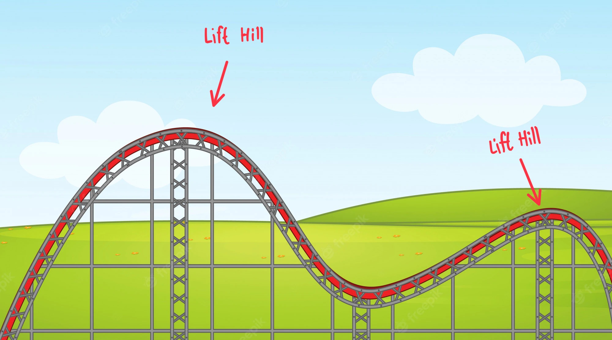

# จอร์จจี้กับรถไฟเหาะหรรษา

จอร์จจี้คือผู้ที่รักและหลงใหลกับการเล่นรถไฟเหาะเป็นชีวิตจิตใจ จอร์จจี้ได้เดินทางไปเล่นรถไฟเหาะมาแล้วหลายแห่งทั่วโลก โดยจอร์จจี้นั้นชื่นชอบการขึ้นทางชันของรถไฟเหาะเป็นอย่างมาก กล่าวคือเมื่อขึ้นไปถึงจุดสูงสุดจุดหนึ่งของราง ตัวรถไฟจะถูกปล่อยลงมาตามทางลาดด้วยแรงโน้มถ่วงของโลก! ซึ่งในทุกที่ที่เขาไป เขาจะทำการจดบันทึกช่วงทางลาดชันขึ้น-ลงของรางรถไฟเหาะ(lift hill) ว่ารางรถไฟเหาะที่เขาไปเล่นนั้นมีทั้งหมดกี่ lift hill และแต่ละ lift hill มีความสูงเท่าไหร่ แต่! ครั้งนี้จอร์จจี้อยากดื่มด่ำและสัมผัสบรรยากาศของวิวบนรถไฟเหาะจนไม่อยากที่จะจดบันทึกช่วง lift hill แบบที่เขาเคยทำด้วยตนเอง ดังนั้นเขาจึงได้ไหว้วานคุณให้ช่วยเขียนโปรแกรมบางอย่างที่จะช่วยนับว่ารถไฟเหาะที่จอร์จจี้ไปเล่นนั้นมี lift hill ทั้งหมดกี่จุด อยู่ที่จุดหมายเลขใดบ้าง และแต่ละจุดมีความสูงเท่าใด

หมายเหตุ : lift hill หมายถึง จุดที่มีความสูงเป็นยอดคล้าย ๆ ยอดเขาเมื่อเทียบกับจุดรอบข้าง

## input

**บรรทัดแรก:** รับค่าจำนวนจุดบนรางรถไฟเหาะ n จุด  
**บรรทัดที่สอง - บรรทัดที่ n+1:** รับค่าตัวเลขความสูง(height) ของจุดต่าง ๆ บนรางรถไฟเหาะ  

## output

**บรรทัดแรก:** ให้แสดงจำนวนของจุด lift hill ว่ามีจำนวนกี่จุด แต่ละจุดอยู่ที่ตำแหน่ง(index) ใดบ้าง และในจุดนั้นมีความสูง(height) เท่าไหร่ตามรูปแบบ

หมายเหตุ : index แรกและ index สุดท้าย หากตัวด้านข้างมีความสูงน้อยกว่าก็ให้ถือว่าเป็น lift hill ได้เลย (ดูได้จาก test case)

| ตัวอย่าง input | ตัวอย่าง output |
| --- | --- |
| 5 3 7 5 1 2 | There are 2 lift hills at index(height): 1(7) 4(2) |
| 1 7 | There is 1 lift hill at index(height): 0(7)  |
| 2 3 3  | There is no lift hill |
| 3 7 2 5 | There are 2 lift hills at index(height): 0(7) 2(5)  |
| | |
