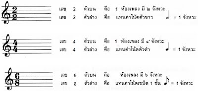

# ดนตรีงานวัด

คุณเป็นนักดนตรีที่ถูกจ้างให้ไปเล่นที่งานวัดแห่งหนึ่ง เมื่อถึงวันงานคุณได้แบกกระเป๋ากีต้าร์กับแฟ้มโน้ตดนตรีไปด้วย เพราะว่าคุณเป็นคนมีสไตล์ชอบอ่านโน้ตดนตรีแบบเป็นกระดาษ ไม่ชอบใช้ไอแพดเปิดคอร์ดดูขณะที่กำลังเดินไปที่เวทีคุณก็ได้เดินผ่านซุ้มของสาวน้อยตกน้ำและทันใดนั้นเอง มีคนปาลูกบอลไปโดนพอดี ทำให้สาวน้อยตกน้ำแล้วน้ำก็สาดเข้าแฟ้มโน้ตดนตรีคุณเข้าอย่างช่ำ ๆ และหลังจากนั้นคุณก็เปิดแฟ้มโน้ตดนตรีคุณดูพบว่า กระดาษโน้ตดนตรีเปียกปอนไปด้วยน้ำและน้ำตาของคุณ แต่โน้ตนั้นไม่ได้เปียกทั้งหมด ยังคงมีส่วนที่เหลืออยู่และพอเดาได้ เมื่อเกิดเหตุการณ์นี้ขึ้นคุณจึงคิดอยากเขียนโปรแกรมเพื่อทำนายตัวโน้ตที่หายไปใน 1 ห้องเพลง   
อธิบายโจทย์เพิ่ม : ตัวโน้ต (Note) เป็นสัญลักษณ์ที่แทน ความสั้น-ยาวของเสียง โดยประกอบไปด้วย  
W แทนโน้ตตัวกลม (Whole Note)  
H แทนโน้ตตัวขาว (Half Note) : มีค่าเป็น ½ เท่าของโน้ตตัวกลม  
Q แทนโน้ตตัวดำ (Quarter Note) : มีค่าเป็น ¼ เท่าของโน้ตตัวกลม  
E แทนโน้ตตัวเขบ็ต 1 ชั้น (Eighth Note) : มีค่า 1/8 เท่าของโน้ตตัวกลม   
ในโน้ตดนตรีจะมีเลข Time Signature กำกับอยู่ ซึ่งไปประกอบไปด้วยเลขบน กับ เลขล่าง เลขตัวบน บอกจำนวนจังหวะใน 1 ห้องเพลง เลขตัวล่าง บอกว่าใช้โน้ตอะไรเป็นเกณฑ์ 1 จังหวะ
  โดย ถ้าเลขล่างเป็น 2 แทนค่าโน้ตตัวขาวเป็น 1 จังหวะ  ถ้าเลขล่างเป็น 4 แทนค่าโน้ตตัวดำเป็น 1 จังหวะ  ถ้าเลขล่างเป็น 8 แทนค่าโน้ตเขบ็ต 1 ชั้นเป็น 1 จังหวะ

**input**

**บรรทัดแรก:** รับค่าเลขตัวบน a และตัวล่าง b ของ Time Signature โดยคั่นด้วยเว้นวรรค  
**บรรทัดที่สอง:** รับห้องเพลง ทั้งหมด 4 ช่องโดยคั่นด้วยช่องว่าง ตัวอย่างเช่น x – W H 

หมายเหตุ:  a > 1 และ b ต้องเป็น 2,4,8 เท่านั้น
ห้องเพลงทั้งหมด 4 ช่องที่รับมา จะต้องประกอบด้วยตัวโน้ตอย่างน้อยหนึ่งตัว

**output**

**ตั้งแต่ 1 บรรทัดขึ้นไป:** ให้แสดงห้องเพลงที่เป็นไปได้ทั้งหมด โดยวิธีการเรียงตัวโน้ตที่หายไปให้เรียงจากค่ามากไปน้อย อย่างเช่น H – W H

หมายเหตุ: ตัวโน้ตที่หายไปจะมีมากสุดแค่ 2 สัญลักษณ์ใน 1 ห้องเพลงเท่านั้น และ ถ้าหากความเป็นไปได้ที่ออกมาเป็นสัญลักษณ์ที่เหมือนกันแต่สลับที่กันได้ ให้นับว่าเป็นกรณีเดียวกัน
และถ้าหาก ห้องเพลงที่รับมามีจำนวนจังหวะของทุกตัวโน๊ต มากกว่า a หรือ output ไม่สามารถหาตัวโน้ตที่ลงตัวมาใส่ได้ ให้แสดงผลบรรทัดเดียวว่า "Impossible"

| ตัวอย่าง input | ตัวอย่าง output |
| --- | --- |
| 3 4 X - H Q   | H – H Q |
| 4 4 X X - H  | H - - H Q Q - H - H - H |
| 6 8 X X - H  | H - - H Q Q - H - H - H |
