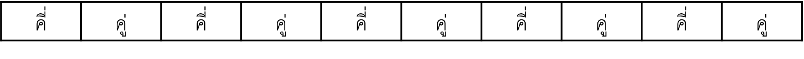
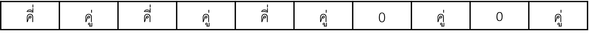
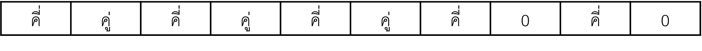
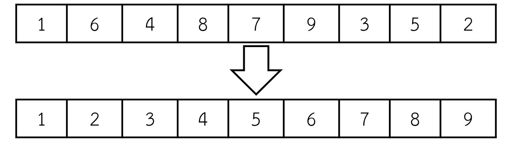
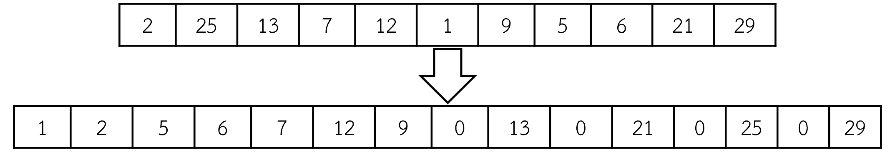

# ธุรกิจของเจ้าตัวน้อย(4)

&nbsp;&nbsp;&nbsp;&nbsp;&nbsp;เจ้าตัวน้อยตัวน้อยเชื่อในเรื่องดวง และเป็นคนเจ้าระเบียบอย่างมาก จึงไม่ชอบตัวเลขแปลก ๆ ที่เกิดขึ้นในชีวิตประจำวัน วันหนึ่งเจ้าตัวน้อยไปจัดร้านหยิบแผ่นป้ายในงานวัดแห่งหนึ่ง   
&nbsp;&nbsp;&nbsp;&nbsp;&nbsp;เจ้าตัวน้อยเห็นว่าตัวเลขที่ลูกค้าหยิบขึ้นมา หาของรางวัลให้ยากมากจึงอยากจะหาวิธีในการหยิบของรางวัลให้ลูกค้าแบบง่าย ๆ โดยเจ้าตัวน้อยเชื่อว่าการเรียงเลขคี่ คู่สลับกัน และทุกเลขคี่จะมีเลขคู่อยู่ด้วยนั้น 
จะทำให้การค้าขายดีขึ้น ดังรูปที่ 1 แต่ถ้าชุดของตัวเลขชุดใดหมดก่อนก็จะเอาเลข 0 คั่นแทน ดังรูปที่ 2 และ 3

**รูปที่ 1 เรียงจำนวนคี่สลับกับคู่ไปเรื่อย ๆ**   

**รูปที่ 2 เรียงจำนวนคี่สลับกับคู่ไปเรื่อย ๆ แต่จำนวนชุดเลขคี่หมดก่อนเลขคู่ จึงแทนเลขคี่ด้วย 0**   

**รูปที่ 3 เรียงจำนวนคี่สลับกับคู่ไปเรื่อย ๆ แต่จำนวนชุดเลขคู่หมดก่อนเลขคู่ จึงแทนเลขคู่ด้วย 0**   

**ตัวอย่างที่ 1** ลูกค้าหยิบแผ่นป้ายจำนวน 9 แผ่นป้าย แล้วได้หมายเลข 1, 6, 4, 8, 7, 9, 3, 5  และ 2 ตามลำดับ เจ้าตัวน้อยจึงนำแผ่นป้ายมาเรียงใหม่ตามความเชื่อ ดังรูปที่ 4

**รูปที่ 4 เรียงแผ่นป้ายใหม่ทั้งหมดตามความเชื่อ**   

**ตัวอย่างที่ 2** ลูกค้าหยิบแผ่นป้ายจำนวน 11 แผ่นป้าย แล้วได้หมายเลข 2, 25, 13, 7, 12, 1, 9, 5, 6, 21 และ 29 ตามลำดับ เจ้าตัวน้อยจึงนำแผ่นป้ายมาเรียงใหม่ตามความเชื่อ ดังรูปที่ 5

**รูปที่ 5 เรียงแผ่นป้ายใหม่ทั้งหมดตามความเชื่อ**   

**งานของคุณ** จงเขียนโปรแกรมที่มีประสิทธิภาพเพื่อเรียงลำดับแผ่นป้ายตามความเชื่อของเจ้าตัวน้อย

**ข้อมูลนำเข้า**
มีจำนวน 2 บรรทัด ดังนี้
| บรรทัด | คำอธิบาย |
| ---- | ---- |
| บรรทัดที่ 1  | ประกอบด้วยจำนวนเต็ม 1 จำนวน n  เมื่อ n แทนจำนวนแผ่นป้ายทั้งหมด โดย 2 <= n <= 999,999,999 |
| บรรทัดที่ 2 | ประกอบด้วยจำนวนเต็ม n จำนวน แต่ละจำนวนคั่นด้วยช่องว่าง “ ”  เมื่อ แต่ละจำนวนระบุหมายเลขบนแผ่นป้าย โดยมีหมายเลขตั้งแต่ 1 ถึง 999,999,999|

**ข้อมูลส่งออก**
มีจำนวน 1 บรรทัด ดังนี้
| บรรทัด | คำอธิบาย |
| ---- | ---- |
| บรรทัดที่ 1 | ประกอบด้วยจำนวนเต็มตั้งแต่ n ถึง 2n จำนวน แต่ละจำนวนคั่นด้วยช่องว่าง “ ”  เมื่อ แต่ละจำนวนคือหมายเลขบนแผ่นป้ายที่เรียงตามความเชื่อของเจ้าตัวน้อยแล้ว |

**ตัวอย่าง**
| ตัวอย่างข้อมูลนำเข้า | ตัวอย่างข้อมูลส่งออก |
| :---- | :---- |
| **9  1 6 4 8 7 9 3 5 2**| **1 2 3 4 5 6 7 8 9 0** |
| **11  1 2 5 10 23 54 68 32 14 13 15** | **1 2 5 10 13 14 15 32 23 68 0 54** |
| **11  2 25 13 7 12 1 9 5 6 21 29** | **1 2 5 6 7 12 9 0 13 0 21 0 25 0 29 0** |
| **10  1 4 5 2 3 5 3 1 4 2** | **1 2 1 2 3 4 3 4 5 0 5 0** |
